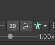

# Getting Back into Game coding

## OMG

What the heck. I fogot so much.

I realize I have no idea what the difference between C# and .NET is...

I have a really bad version here of something here:
https://github.com/couryrr/unity-first-game

## Things That are confusing me

1. How did I scale the sprites before
   1. Well I just enlarged it... with the box control
   2. I thought that it was done when I made the animation
2. How did I Create the grid map tile stuff
3. Animator :angry:

## Updating

I found a user controller from this video https://youtu.be/3sWTzMsmdx8 and since mine did not work at all I am going to try and use it.

There is a custom collision object for this controller. I am not sure if this is for the best but it is pretty smooth.

Animator is broke now...Where is the screen for this thing?

## Couple things

To see animation if you click the guy icon and then select other it will show you the assests.

Make sure to check all the component that are attached to a given object and what those get assigned to in a script.

Particle, trail renderer.

Such a good video
https://www.youtube.com/watch?v=hkaysu1Z-N8

> From the code perspective look at transitions
